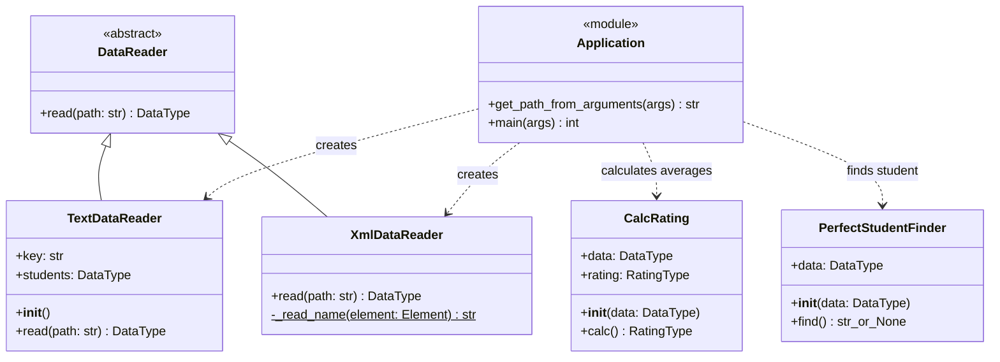

# Лабораторная работа по дисциплине «Технологии программирования»

Учебный проект `rating-vasilev`: чтение оценок студентов, вычисление среднего
балла и поиск студента со 100 баллами по всем дисциплинам.

## Постановка задачи

Индивидуальный вариант: входной файл имеет формат **XML**. Необходимо определить
и вывести на экран студента, имеющего **ровно 100 баллов по каждой дисциплине**.
Если таких студентов несколько, можно вывести любого; программа выбирает
первого в порядке входного файла. Если подходящих студентов нет, выводится
сообщение об их отсутствии.

В рамках работы необходимо:

1. Выбрать лицензию и добавить файл лицензии.
2. Настроить `.gitignore`.
3. Реализовать наследника `DataReader` для XML и модульные тесты в отдельной
   ветке от главной; после успешных проверок объединить её с главной.
4. Реализовать класс поиска студента и его тесты во второй отдельной ветке
   от главной; после успешных проверок выполнить объединение.
5. Составить UML-диаграмму классов.
6. Проанализировать результаты и сформулировать выводы.

Студент без дисциплин не считается подходящим: у него нет оценок, подтверждающих
выполнение условия. Пустой список студентов также приводит к сообщению об
отсутствии подходящего студента. Средний балл 100 сам по себе не заменяет
проверку каждого отдельного балла.

## Описание проекта и технологии

Язык — Python 3.14. Для запуска и управления зависимостями
используется `uv`, для модульных тестов — `pytest`, для проверки стиля PEP 8 —
`pycodestyle`, для измерения покрытия строк и ветвлений — `pytest-cov`.
Git хранит историю разработки, GitHub Actions автоматически запускает проверки.
Версии зависимостей зафиксированы в `uv.lock`.

```text
.github/workflows/github-actions-testing.yml  — автоматические проверки
data/                                       — примеры TXT и XML
src/
    Types.py                                — общий тип данных DataType
    DataReader.py                           — абстрактный интерфейс чтения
    TextDataReader.py                       — чтение исходного TXT-формата
    XmlDataReader.py                        — чтение и проверка XML
    CalcRating.py                           — вычисление средних баллов
    PerfectStudentFinder.py                 — поиск студента по условию
    main.py                                 — консольная программа
test/                                       — модульные тесты
docs/classes.mmd                            — исходный текст UML-диаграммы
LICENSE                                     — лицензия MIT
pyproject.toml                              — зависимости и настройки pytest
```

Общий тип данных:

```python
DataType = dict[str, list[tuple[str, int]]]
```

Ключ словаря — имя студента, значение — список пар «дисциплина, балл».
`XmlDataReader.read()` преобразует XML в этот тип. Каждый вызов создаёт новый
словарь, поэтому результаты повторных чтений не смешиваются.
`PerfectStudentFinder.find()` возвращает имя первого подходящего студента либо
`None`. Поиск занимает O (N + S) времени в худшем случае, где N — число
студентов, S — общее число их дисциплин, и O (1) дополнительной памяти.
`CalcRating.calc()` сохраняет прежнюю возможность расчёта средних баллов;
для студента без дисциплин он возвращает `0.0`.

## Формат XML

Корневой элемент — `<students>`. Внутри находятся элементы `<student>`
с атрибутом `name`. Каждый `<subject>` задаёт дисциплину атрибутом `name`
и целочисленный балл атрибутом `score`.

Пример из [data/students.xml](data/students.xml):

```xml
<?xml version="1.0" encoding="utf-8"?>
<students>
    <student name="Иванов Иван Иванович">
        <subject name="математика" score="80"/>
        <subject name="программирование" score="90"/>
    </student>
    <student name="Петров Петр Петрович">
        <subject name="математика" score="100"/>
        <subject name="программирование" score="100"/>
        <subject name="литература" score="100"/>
    </student>
</students>
```

Имена должны быть непустыми; пробелы по краям имён удаляются. Имена студентов
должны быть уникальны, как и названия дисциплин внутри одного студента.
Баллы должны быть целыми числами от 0 до 100 включительно. Неожиданные теги,
вложенные элементы внутри `<subject>`, отсутствующие атрибуты и неверные
баллы вызывают `ValueError`. Повреждённый XML вызывает `ParseError`, отсутствие
файла — `FileNotFoundError`. Консольная программа выводит ошибку чтения
в stderr и завершается с кодом 1.

## Установка и запуск

Необходимы Python 3.14+ и установленный `uv`. Все команды выполняются из корня
проекта; запуск и проверки одинаковы для Windows и Linux.

```shell
uv sync --locked
uv run --locked python src/main.py -p data/students.xml
```

Программа выводит прочитанные данные, средние баллы и результат поиска.
Последняя строка для данного примера:

```text
Студент со 100 баллами по всем дисциплинам: Петров Петр Петрович
```

Пример, в котором подходящих студентов нет:

```shell
uv run --locked python src/main.py -p data/no_perfect_students.xml
```

Последняя строка:

```text
Студентов со 100 баллами по всем дисциплинам нет.
```

Файлы с расширением `.xml` читаются XML-читателем; регистр расширения неважен.
Для остальных файлов используется прежний текстовый читатель. Пример TXT:

```shell
uv run --locked python src/main.py -p data/data.txt
```

В TXT имя студента находится на отдельной строке, а строки его дисциплин
начинаются с пробела и имеют вид ` название:балл`. Справка: `uv run python
src/main.py --help`. Код завершения 0 означает успешную обработку, даже если
подходящий студент не найден; 2 — ошибку аргументов командной строки.

## Тесты и автоматические проверки

```shell
uv run --locked pycodestyle src test
uv run --locked pytest test --cov=src --cov-branch --cov-report=term-missing --cov-fail-under=95
```

Пути импортов настроены в `pyproject.toml`, поэтому устанавливать переменную
`PYTHONPATH` для pytest вручную не требуется.

| Модуль тестов                  | Проверяемые случаи                                                                                                                                            | Количество |
|--------------------------------|---------------------------------------------------------------------------------------------------------------------------------------------------------------|-----------:|
| `test_XmlDataReader.py`        | UTF-8, несколько студентов, пустые данные, пробелы, границы баллов, ошибки структуры и значений, дубликаты, повреждённый/отсутствующий файл, повторное чтение |         21 |
| `test_PerfectStudentFinder.py` | один и несколько кандидатов, отсутствие кандидатов, пустые данные и дисциплины, смешанные баллы, повторный поиск без изменения данных                         |         14 |
| `test_CalcRating.py`           | инициализация, средние баллы всех студентов, пустые данные, отсутствие дисциплин, повторный расчёт                                                            |          5 |
| `test_TextDataReader.py`       | чтение UTF-8 TXT и сопоставление полного результата                                                                                                           |          1 |
| `test_main.py`                 | аргументы и справка, вывод кандидата и сообщения об отсутствии, TXT/XML, ошибки чтения, запуск точки входа                                                    |         17 |

Результат локальной проверки: **58 тестов успешно**, `pycodestyle` ошибок не
обнаружил.

Workflow запускается при push в `master` и `feature/**`, а также при pull request
в `master`. На Ubuntu с Python 3.14 он устанавливает зависимости по lock-файлу,
запускает линтер, затем тесты.

## UML-диаграмма классов

Её отдельный исходник: [docs/classes.mmd](docs/classes.mmd).
`Application` обозначает модуль `main.py`, а не дополнительный класс Python.



## Анализ результатов и выводы

Задача индивидуального варианта выполнена: программа читает XML, находит
студента со 100 баллами по каждой дисциплине и выводит его имя либо сообщение
об отсутствии. XML-читатель проверяет данные до вычислений и сообщает об ошибках
вместо молчаливого пропуска некорректных записей.

Наследование от `DataReader` позволяет добавлять форматы файлов через отдельные
классы, сохраняя единый тип данных для вычислений. Поиск вынесен в самостоятельный
класс и не зависит от XML или консольного вывода. В тестах отдельно проверены
пограничные случаи: пустые данные, студент без дисциплин, единственный балл ниже
100 и несколько подходящих студентов.

Разработка в двух ветках с коммитами реализации и тестов позволяет проследить
каждый этап. Проверки стиля, тестов и покрытия автоматически выявляют ошибки
перед объединением. Высокое покрытие подтверждает выполнение проверяемых путей,
но корректность результата определяется содержанием проверок, поэтому тесты
сравнивают полные данные и фактический результат поиска.

Программа предназначена для локальных учебных файлов. XML загружается целиком
в память; для существенно больших наборов данных возможным развитием является
потоковое чтение и отделение конфигурации схемы от читателя.